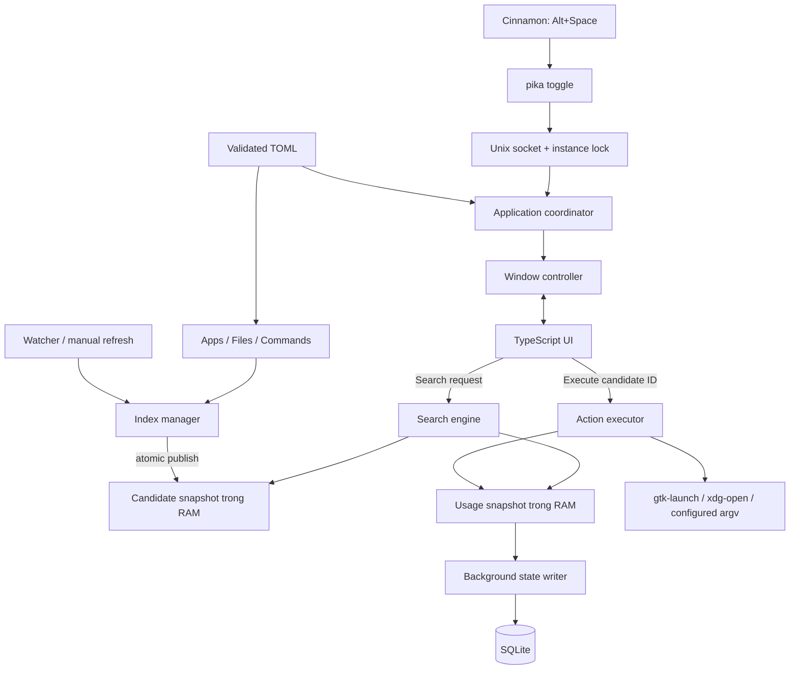

# Pika — Kế hoạch triển khai launcher cá nhân

Ngày lập: 10/09/2026. Trạng thái: thiết kế đề xuất, chưa triển khai tính năng.

## 1. Kết quả cần đạt

Pika là launcher desktop phục vụ một người dùng trên Linux Mint/Cinnamon: gọi nhanh bằng bàn phím, tìm và mở ứng dụng, tìm file/folder trong các thư mục đã chọn, chạy các lệnh cá nhân đã cấu hình, tùy chỉnh giao diện và cách tìm kiếm.

Tên sản phẩm trong repo là **Pika**; ứng dụng tham chiếu trong [cuộc trò chuyện bạn cung cấp](https://chatgpt.com/share/6aa2cf37-0b48-83ec-b24d-794f6aec774f) là **Look**. Kế hoạch này hiểu yêu cầu là xây Pika thành lựa chọn thay thế Look, phù hợp workflow cá nhân của bạn.

Ba luồng nghiệm thu chính:

1. `Alt+Space → gõ fir → chọn Firefox → Enter → gửi yêu cầu mở Firefox → Pika ẩn`.
2. `Alt+Space → gõ tên tài liệu không dấu → chọn file → Enter → mở bằng ứng dụng mặc định`.
3. `Alt+Space → gõ > pika → chọn Open Pika project → Enter → mở project bằng editor đã cấu hình`.

Mục tiêu sản phẩm là giảm thao tác hằng ngày, giữ quyền kiểm soát config và dữ liệu trên máy. Phần tìm kiếm/index của Pika hoạt động offline; ứng dụng hay command được mở có thể tự dùng mạng theo chức năng của chúng.

## 2. Điểm xuất phát đã kiểm tra

| Thành phần | Hiện trạng | Quyết định |
|---|---|---|
| Hệ điều hành | Linux Mint 22.3, Cinnamon, phiên X11 | Đây là môi trường nghiệm thu v1 |
| Go | `go.mod` khai báo 1.25.0; công cụ cài trên máy là 1.27.1 | Giữ khai báo hiện có, ghi toolchain thực tế khi benchmark |
| Desktop framework | Wails v2.15.0 trong repo và CLI | Tiếp tục dùng v2.15.0 |
| Frontend | Vanilla TypeScript, Vite 7, TS 5.6 | Giữ stack; UI nhỏ chưa cần framework |
| Native dependencies | GTK 3.24.41, WebKitGTK 4.1 phiên bản 2.52.6; không tìm thấy 4.0 qua pkg-config | Chuẩn hóa build/dev/test native với tag `webkit2_41` |
| Linux launch helpers | Có `gtk-launch`, `xdg-open` | Dùng qua adapter thực thi |
| `main.go` | Window 1024×768, embed `frontend/dist` | Giữ entrypoint ở root để tiếp tục dùng pipeline Wails hiện tại |
| `app.go`, frontend | Chỉ có ví dụ `Greet` | Chưa có search, index, IPC, config hoặc persistence |

Wails hướng dẫn dùng `webkit2_41` khi hệ thống có WebKitGTK 4.1 thay cho 4.0. Đây là yêu cầu build cụ thể của máy này, cần đưa vào Makefile/README ngay từ đầu. [Wails installation](https://wails.io/docs/gettingstarted/installation/)

Những kiểm tra trên là đọc repo và môi trường. Chưa có kết quả build launcher, thử phím tắt hay benchmark tính năng Pika.

## 3. Phạm vi và mức ưu tiên

| Nhóm | Bắt buộc làm | Kết quả quan sát được | Mốc |
|---|---|---|---|
| Window | Frameless, show/hide, focus, Escape, đóng để ẩn | Gọi lại cửa sổ đang chạy; không tạo WebView mới mỗi lần | M1 |
| Desktop integration | CLI toggle, single instance, Cinnamon shortcut | Bấm phím tắt từ ứng dụng khác vẫn nhập được ngay | M1 |
| App search | Đọc desktop entries, normalize, prefix/fuzzy, mở app | Tìm và mở các app thực tế đang dùng | M2 |
| Keyboard UI | Up/Down/Enter/Escape, trạng thái rỗng/lỗi, IME | Dùng trọn luồng bằng bàn phím, gõ tiếng Việt đúng | M2 |
| Customization | TOML, dark/light/custom, kích thước/font/màu | Đổi giao diện và hành vi mà không sửa code | M1–M3 |
| Personal commands | Command có ID, tên, alias, executable, args, cwd | Mở project hoặc chạy script cá nhân qua `>` | M3 |
| Ranking | Frequency, recency, pins, lưu state | Thứ tự hữu ích hơn và còn sau khi restart | M3 |
| File search | Roots, exclude, giới hạn depth/count, mở file/folder | Tìm đúng dữ liệu đã chọn; bỏ qua dependency/build trees | M4 |
| Index freshness | Reindex thủ công, watcher giới hạn, reconciliation | Tạo/đổi tên/xóa file được phản ánh theo chính sách đã công bố | M4–M5 |
| Vận hành cá nhân | Install/uninstall, autostart tùy chọn, stats, recovery | Login lại vẫn dùng được; cập nhật binary giữ config/state | M6 |

Không thuộc v1: AI, clipboard history, calculator, dịch thuật, todo, nội dung file/full-text search, cloud sync, tài khoản, telemetry, marketplace/plugin runtime, tích hợp Docker/Kubernetes động, hỗ trợ macOS/Windows, cam kết Wayland, blur desktop thật.

Sau M2 đã có MVP mở ứng dụng. Sau M3 có bản phù hợp dùng hằng ngày cho app và workflow cá nhân. M4–M6 mở rộng thành v1 đầy đủ.

## 4. Quyết định kiến trúc

| Vấn đề | Chọn cho Pika | Lý do / giới hạn |
|---|---|---|
| Go hay Rust | Go | Tận dụng repo và kỹ năng hiện có; kiểm chứng latency bằng đo thực tế |
| UI | Wails + TS/CSS | Tùy biến trực tiếp bằng CSS; tránh đổi stack khi chưa có sản phẩm |
| Bắt hotkey | Cinnamon gọi `pika toggle` | Giữ phần global shortcut ở desktop environment |
| IPC | Unix socket + `flock` | CLI xử lý trước `wails.Run`; có ACK, timeout, status và reindex |
| Single-instance authority | Chỉ một cơ chế lock trong IPC | Không chồng thêm một cơ chế sở hữu độc lập của Wails |
| Search | Candidate đã chuẩn bị trong RAM | Không đọc file hay query SQLite theo từng phím |
| Index updates | Snapshot bất biến, thay thế nguyên tử | Search tiếp tục dùng snapshot cũ khi background scan |
| Usage | State trong RAM riêng + SQLite | Mở app không phải rebuild toàn bộ file index |
| Config | TOML là nguồn cấu hình duy nhất | Dễ sửa/backup; không có một bản settings khác trong DB |
| Extension | Source trả Candidate + executor xử lý action | Có chỗ mở rộng mà chưa cần plugin framework |

Wails có sẵn `SingleInstanceLock`; lựa chọn socket + flock ở đây là quyết định thiết kế để có CLI riêng, không phải do Wails thiếu single-instance. [Wails options](https://wails.io/docs/reference/options/#singleinstancelock)



Quy tắc dependency: `domain` không biết Wails/SQLite/fsnotify; `search` chỉ xử lý dữ liệu RAM; source không gọi UI; watcher gửi yêu cầu refresh; `App` lắp các phần bằng constructor thủ công.

## 5. Cấu trúc repo sẽ phát triển

Chỉ tạo package khi có milestone sử dụng. Giữ `main.go` và `app.go` ở root; chưa chuyển sang `cmd/pika` vì `go:embed` và Wails build hiện bám cấu trúc root.

```text
pika/
  main.go                         # CLI dispatch, dependency wiring, wails.Run
  app.go                          # Wails bridge mỏng
  internal/
    app/                          # coordinator, lifecycle, window
    domain/                       # Candidate, Action, SearchResult
    config/                       # defaults, TOML, validation, reload
    ipc/                          # protocol, client, server, lock
    search/                       # normalize, match, ranking, top-k
    index/                        # source contract, manager, snapshot
    sources/
      applications/               # XDG discovery, desktop entries
      filesystem/                 # walker, exclusions, limits
      commands/                   # config -> candidates
    action/                       # Linux execution, process supervision
    storage/                      # SQLite, migrations, usage writer
    watcher/                      # watch registration, debounce, reconciliation
    platform/linux/               # XDG paths, icons, environment checks
  frontend/src/
    main.ts                       # bootstrap
    bridge.ts                     # Wails calls và events
    state.ts                      # query, results, selection, request version
    launcher.ts                   # render input/results/status
    keyboard.ts                   # keyboard, IME
    theme.ts                      # semantic CSS tokens
    styles/                       # base, launcher, themes
  frontend/wailsjs/                # generated; không sửa tay
  testdata/                       # desktop/file/search fixtures
  docs/                           # plan, config, installation, benchmarks
  Makefile
  wails.json
```

## 6. Window lifecycle và IPC

### 6.1 Hành vi CLI

| Lệnh | Instance đang chạy | Chưa có instance |
|---|---|---|
| `pika` | Show | Start và show |
| `pika --background` | ACK, không toggle | Start hidden |
| `pika toggle` | Show nếu hidden, hide nếu visible | Start và show |
| `pika show` | Show, focus input | Start và show |
| `pika hide` | Hide | No-op thành công |
| `pika quit` | Shutdown thật | No-op thành công |
| `pika reindex` | Queue refresh, trả job ID | Lỗi rõ “Pika chưa chạy” |
| `pika reload-config` | Validate và apply | Lỗi rõ “Pika chưa chạy” |
| `pika stats` | Trả trạng thái hiện tại | Lỗi rõ “Pika chưa chạy” |

CLI client không gọi `wails.Run` khi gửi lệnh cho instance cũ. Khi cần start từ `toggle/show`, spawn đúng binary hiện tại với intent show, chờ readiness có timeout 5 giây. Nếu startup lâu hơn, báo đang khởi động/timeout; không kết luận process đã chết hay spawn lặp vô hạn.

### 6.2 Sở hữu process và protocol

- Thư mục runtime: `$XDG_RUNTIME_DIR/pika/`, mode `0700`; socket `control.sock`, mode `0600`; lock `instance.lock`.
- Giữ file descriptor flock suốt đời process. Chỉ process lấy được lock mới có quyền dọn socket stale và listen.
- Nếu lock bận nhưng socket chưa ready: retry có giới hạn. Không unlink socket chỉ vì một lần dial thất bại.
- Không unlink lock file lúc shutdown, để tránh hai process khóa hai inode khác nhau.
- Nếu runtime dir không hợp lệ/không thuộc user: báo lỗi có hướng khắc phục; không tự dùng socket chung ở `/tmp`.
- JSON một dòng; protocol version 1; request ID; command allowlist; tối đa 4 KiB/request; read/write deadline; ACK có `ok`, `code`, `message`.
- Cache request ID ngắn hạn để retry cùng lệnh toggle không làm đảo trạng thái hai lần.
- Các lệnh cửa sổ đi qua một hàng đợi tuần tự. Một biến `atomic.Bool` riêng lẻ không đủ bảo đảm toggle liên tiếp đúng thứ tự.
- Lock có trước GUI; readiness gồm runtime sẵn sàng và frontend đăng ký handler/focus thành công. Intent show đến sớm phải được giữ lại.

Các thư mục config/data/cache/runtime theo biến XDG thay vì hardcode home. [XDG Base Directory Specification](https://specifications.freedesktop.org/basedir/latest/)

### 6.3 Window

- State: `starting → hidden/visible → stopping`. Escape và close đều chuyển sang hidden; `quit` mới kết thúc process.
- Window khởi đầu rộng 720, cao tối đa 480; giới hạn theo vùng làm việc của màn hình. Danh sách cuộn nếu không đủ chỗ.
- Show đưa window ra trước và focus input sau khi frontend ready. Mặc định xóa query khi mở lại; cho phép `remember_query`.
- M1 kiểm chứng focus thật từ terminal, browser, editor; không xem `WindowShow()` trả về là đủ.
- Các đường ẩn phải đồng bộ state, kể cả đóng cửa sổ và shortcut khi visible. Kiểm thử riêng close callback của Wails trên Linux.
- Mặc định chưa auto-hide khi mất focus để tránh lỗi với IME/dialog. Chỉ bật tùy chọn này sau khi thử native đúng.
- V1 căn giữa màn hình chứa launcher, clamp vào viewport; tự chuyển sang màn hình con trỏ là cải tiến sau nếu API/native test cho phép.
- Giữ `Super+Space` cho IBus theo nhu cầu trong chat. Cấu hình Alt+Space trong Cinnamon sau khi kiểm tra binding hiện tại; hướng dẫn gỡ xung đột cụ thể, không tự reset toàn bộ keyboard settings.

Wails cung cấp `StartHidden`, `HideWindowOnClose` và show/hide runtime; focus, compositor, nhiều màn hình vẫn cần nghiệm thu trên Cinnamon thực tế. [Wails options](https://wails.io/docs/reference/options/), [Window runtime](https://wails.io/docs/reference/runtime/window/)

## 7. Dữ liệu, search và index

### 7.1 Contract tối thiểu

```go
// Contract định hướng, chưa phải code đã triển khai.
type Candidate struct {
    ID       string
    SourceID string
    Kind     CandidateKind // app, file, directory, command
    Name     string
    Subtitle string
    Aliases  []string
    IconKey  string
    Action   Action // typed: DesktopID hoặc Path hoặc CommandID
}

type Source interface {
    ID() string
    Collect(ctx context.Context) (Collection, error)
}

type SearchRequest struct {
    RequestID uint64
    Query     string
    Limit     int
}

type SearchResponse struct {
    RequestID       uint64
    SnapshotVersion uint64
    Results         []SearchResult
}
```

`Collection` chứa candidates, warnings, scope, trạng thái complete/partial. Không biểu diễn mọi lỗi scan thành một danh sách rỗng thành công.

ID ổn định: app theo desktop ID; file/folder theo absolute cleaned path; command theo ID người dùng khai báo. Root trùng nhau không tạo candidate trùng. Đổi tên file tạo ID mới; v1 không theo dõi inode để chuyển lịch sử.

Bridge dự kiến: `Search(request)`, `Execute(candidateID)`, `Hide()`, `FrontendReady()`, `GetConfig()`, `ReloadConfig()`, `Reindex(scope)`, `GetStats()`. Chỉ expose các method cần thiết qua facade `App`.

Frontend nhận DTO gồm ID/kind/title/subtitle/icon key; không truyền arbitrary command/path vào Execute. Backend resolve lại ID từ snapshot hiện tại và config đang có hiệu lực.

### 7.2 Matching và ranking

1. Chuẩn bị name/path/aliases lúc index: Unicode normalization, lowercase, tách word boundary, dạng không dấu; map riêng `đ/Đ → d`.
2. Giữ nguyên tên gốc để hiển thị. Nếu làm highlight, lưu mapping về ký tự gốc; không dùng byte offset của chuỗi đã bỏ dấu.
3. Query rỗng: pins → gần dùng → thường dùng → apps theo tên; không đổ hàng nghìn file lên UI.
4. Query bắt đầu `>`: chỉ command source, bỏ prefix trước khi match. Query thường tìm apps/files/folders và alias command đã cấu hình.
5. Mức match: exact name/alias → prefix → word-prefix → contains → fuzzy subsequence. Ví dụ `frfx` có thể match Firefox; v1 không hứa sửa mọi lỗi chính tả như một spellchecker.
6. Dùng thứ tự so sánh ổn định: match tier trước, rồi điểm trong tier gồm chất lượng match, ưu tiên kind, bonus usage/recency có trần, cuối cùng tên và ID.
7. Usage nhiều không được đẩy fuzzy match vượt exact match. Pin chỉ ưu tiên candidate có match khi query khác rỗng.
8. Search path có trọng số thấp hơn name/alias. Query nhiều từ yêu cầu đủ token; có test riêng cho name + parent path.
9. Limit mặc định 10, tối đa 20; query tối đa 256 ký tự. Normalize query một lần, không normalize lại mọi candidate.
10. Bắt đầu bằng implementation dễ kiểm chứng; nếu sort/matcher không đạt ngân sách thì dùng bounded top-k, giảm allocation hoặc lọc sơ bộ. Chỉ thêm prefix cache/trigram sau profiling.

Gợi ý bonus trong cùng tier: `usage = min(20, 4*log1p(count))`; recency tối đa 10 và giảm theo tuổi. Đây là tham số khởi điểm; điều chỉnh bằng bộ query cá nhân có expected top results.

### 7.3 Concurrent search và refresh

- Snapshot candidate bất biến sau publish, gồm `version`, prepared candidates, map ID, source status. Không sửa slice/map/runes bên trong.
- IndexManager có một writer; refresh source theo scope, merge với các source không đổi rồi atomic publish.
- Source refresh độc lập: app search sẵn sàng trước; file scan chạy nền và không trì hoãn việc mở window.
- Gộp các refresh trùng. Đang scan mà có event mới thì đánh dấu pending và chạy thêm một lượt sau; không tạo vô hạn goroutine.
- Usage dùng snapshot/map riêng, cập nhật bằng copy-on-write hoặc lock rất ngắn. Search lấy view một lần; không copy 50k candidates mỗi lần mở app.
- Query đã bắt đầu được dùng snapshot cũ tới hết; UI loại response cũ bằng request ID và visibility generation.
- Reindex xong phát event có version; UI đang visible chạy lại query hiện tại. Event chỉ báo invalidation, không đẩy cả index sang JS.
- Refresh hoàn chỉnh được phép loại các candidate đã xóa. Refresh lỗi giữ phần tốt đã có, đánh dấu stale; scope permission lỗi không âm thầm xóa toàn bộ kết quả cũ.

## 8. Các nguồn dữ liệu và action

### 8.1 Applications

- Khám phá `applications/` theo XDG_DATA_HOME/XDG_DATA_DIRS, gồm các export Flatpak khi được đăng ký. Kiểm tra thêm các root Flatpak phổ biến nếu thiếu, gộp và báo source status.
- Xử lý precedence theo desktop ID trước khi lọc hiển thị, để user override/Hidden không làm bản system hiện trở lại.
- Đọc Type, Name/localized Name, GenericName, Keywords, Icon, Hidden, NoDisplay, OnlyShowIn, NotShowIn, TryExec. Parser hiểu group và escaping; không lấy field trong Desktop Action thay cho Desktop Entry.
- V1 chưa liệt kê sub-actions/New Window của từng app.
- Candidate giữ desktop ID; gọi launcher helper với một argv riêng. Không tự split `Exec=` bằng khoảng trắng hoặc đưa vào shell.
- Nghiệm thu ứng dụng user/system/Flatpak, desktop ID có thư mục con, executable có khoảng trắng/field codes, app cần terminal, D-Bus activation theo helper của desktop.

Desktop IDs, precedence, localized values và các khóa visibility phải dựa trên chuẩn, có fixtures đối chiếu. [Desktop Entry Specification](https://specifications.freedesktop.org/desktop-entry/latest/)

### 8.2 Files và folders

- Chỉ index metadata phục vụ tên/path; không đọc nội dung, tạo thumbnail hoặc index toàn home.
- Mặc định file search tắt cho đến khi roots được chọn. Gợi ý Documents/Downloads và `~/workspace/me`; không giả định `~/Projects` tồn tại.
- WalkDir; prune `.git`, `node_modules`, `.cache`, `vendor`, `dist`, `build` trước khi đi vào cây; hỗ trợ exclude tên thư mục và glob tương đối theo root với semantics được ghi rõ.
- Bỏ hidden và temporary files mặc định. Exclude theo thành phần đường dẫn; không dùng substring gây bỏ nhầm `my-build-notes`.
- Mặc định depth 8, giới hạn tổng 50k file/folder candidates; thứ tự duyệt ổn định. Khi chạm giới hạn, báo partial và root bị cắt, không báo complete.
- Canonicalize root được cấu hình; không follow directory symlinks trong cây. Symlink có thể hiện như item có target để mở; không recurse để tránh loop.
- Permission denied/root mất kết nối: warning theo scope, tiếp tục root khác, không panic. Root vừa bị loại khỏi config phải bỏ candidate và watch tương ứng.
- Khi Execute: kiểm tra ID/path còn hợp lệ; file bị xóa phải báo lỗi và queue refresh.

Mở file/folder bằng absolute path với argv riêng qua `xdg-open`; xử lý cả khoảng trắng, Unicode và tên bắt đầu bằng dấu gạch. [xdg-open manual](https://portland.freedesktop.org/doc/xdg-open.html)

### 8.3 Commands và quản lý process

- Command là dữ liệu user cấu hình: ID duy nhất, title, aliases, executable, args[], cwd, terminal flag. Không có command tự sinh từ raw query trong v1.
- Mở project/editor/terminal hoặc gọi script có sẵn là đủ cho v1; chưa thêm parameter templating hay shell pipeline ngầm.
- Truyền executable + args trực tiếp. Nếu cần shell workflow, người dùng viết script và cấu hình đường dẫn script rõ ràng.
- Không phụ thuộc login shell để tìm chương trình. Validate executable với môi trường desktop thực tế; hỗ trợ absolute executable và báo lỗi khi PATH không có `code`.
- Terminal adapter có executable và argv prefix; không hardcode mọi terminal đều hiểu cùng một flag.
- Mỗi process đã Start phải có Wait/reap. Không gắn lifetime app vừa mở với request context ngắn hoặc việc Pika hide/quit.
- Phân biệt “đã gửi yêu cầu mở” với “app đích đã hiển thị”. Không có API chung bảo đảm mọi ứng dụng đã dựng window.
- Thiếu executable/path hoặc helper lỗi ngay: giữ Pika và hiện lỗi. Sau khi dispatch được chấp nhận: ẩn Pika, cập nhật usage của lượt dispatch; lỗi đến muộn được ghi trạng thái/notification có giới hạn.
- Chặn double Enter trong lúc dispatch để tránh mở lặp. Không chờ toàn bộ đời ứng dụng con mới cho launcher dùng tiếp.

## 9. Config và theme: phải dùng được sớm

File cấu hình: `$XDG_CONFIG_HOME/pika/config.toml`, mặc định `~/.config/pika/config.toml`.

Ví dụ cấu hình cá nhân sau M4; executable `code` chỉ là ví dụ và phải được kiểm tra trên máy:

```toml
schema_version = 1

[window]
width = 720
max_height = 480
remember_query = false
hide_on_blur = false

[search]
max_results = 10
fold_accents = true
app_search = true
file_search = true
commands_in_general_search = true

[index]
roots = ["~/Documents", "~/Downloads", "~/workspace/me"]
exclude_dirs = [".git", "node_modules", ".cache", "vendor", "dist", "build"]
exclude_globs = ["**/*.swp", "**/*.tmp", "**/*.crdownload"]
include_hidden = false
max_depth = 8
max_candidates = 50000

[watcher]
enabled = true
mode = "bounded_recursive"
max_directories = 4096
debounce_ms = 1000
cooldown_ms = 3000
reconcile_interval_seconds = 900

[appearance]
theme = "custom"
font_family = "system-ui"
font_size = 16
radius = 16
panel_alpha = 1.0

[appearance.colors]
background = "#151821"
surface = "#202532"
text = "#ECEFF4"
muted = "#AAB2C0"
selection = "#33466B"
accent = "#8CB4FF"
border = "#424B5C"
error = "#FF8E8E"

[ranking]
enabled = true
pinned_ids = ["command:open-pika"]

[[commands]]
id = "open-pika"
name = "Open Pika project"
aliases = ["pika", "project pika"]
executable = "code"
args = ["/home/lilmint/workspace/me/pika"]
cwd = "/home/lilmint/workspace/me/pika"
terminal = false
```

Tiêu chí bắt buộc:

- Default config được sinh một lần nếu chưa có; không ghi đè config của người dùng khi upgrade.
- Validate schema/version, unknown keys, giới hạn số, màu, duplicate command ID, roots và executable. Path root thiếu có thể là warning; cấu trúc hoặc giá trị sai là lỗi reload.
- Expand `~/` cho các field path đã định nghĩa. Không hứa shell expansion cho mọi string, args hoặc `$VAR`.
- Reload là transaction: parse → validate → dựng trạng thái mới → apply. Sai config giữ cấu hình tốt đang chạy và hiện file/field lỗi.
- Theme/size/search preferences apply ngay; đổi roots/exclusions queue reindex và cập nhật watches. Socket path không thuộc config chỉnh tự do ở v1.
- Semantic CSS tokens cho background/text/selection/border/accent; cả empty/error/loading state phải theo theme.
- Có dark, light và custom. Custom màu, font, kích thước/radius là yêu cầu v1; editor theme GUI và arbitrary CSS để sau.
- Dùng alpha nền panel, không đặt opacity lên toàn bộ cây UI làm chữ mờ. Opaque là baseline; translucency là tùy chọn phải kiểm thử native; không cam kết blur desktop.
- `pika reload-config` và action “Reload config” có phản hồi thành công/lỗi. Chưa cần settings GUI hoàn chỉnh.

## 10. Persistence và watcher

### 10.1 Usage state

SQLite ở `$XDG_DATA_HOME/pika/state.db`. Config không nằm trong SQLite. M1–M2 chưa cần DB; M3 thêm một driver qua `database/sql`, pin phiên bản đã thử build trên máy. Ưu tiên `mattn/go-sqlite3` cho môi trường vốn đã có CGO; xác nhận dependency ở M3.

```sql
CREATE TABLE usage (
    candidate_id TEXT PRIMARY KEY,
    use_count INTEGER NOT NULL DEFAULT 0,
    last_used_at INTEGER NOT NULL
);
```

- Migration đánh phiên bản; timestamp UTC; ghi prepared statements/transaction qua một writer.
- Startup load usage vào RAM; mỗi dispatch cập nhật RAM ngay, gom ghi tối đa 1 giây/lần; graceful quit flush.
- Crash có thể mất phần usage chưa flush, tối đa khoảng cửa sổ gom ghi khi DB bình thường. Không hứa durability nếu DB đang lỗi kéo dài.
- Ghi lỗi: giữ pending updates có giới hạn theo candidate, retry có backoff, báo persistence degraded; tuyệt đối không retry loop chiếm CPU.
- DB hỏng: ứng dụng vẫn search được không có ranking bền vững; giữ file hỏng để khôi phục, không tự xóa.
- V1 không lưu raw query history hoặc usage_events vô hạn. Candidate index disk cache chỉ thêm nếu startup/file-scan đo được cần thiết.

### 10.2 Watcher có hợp đồng freshness rõ ràng

`fsnotify` không tự theo dõi thư mục con. Watch mỗi root không đủ phát hiện mọi thay đổi file sâu trong cây. [fsnotify FAQ](https://github.com/fsnotify/fsnotify#are-subdirectories-watched)

Chính sách mặc định M5:

1. Đăng ký watch cho các thư mục trong phạm vi đã index, với cùng exclusions/depth, tối đa 4096 directory watches của Pika.
2. Tạo thư mục mới: đăng ký bổ sung và scan nhánh; rename/delete: remove watch và đánh dấu scope dirty.
3. Debounce 1 giây; mỗi scope không bắt đầu refresh thường xuyên hơn 3 giây; luôn có trailing refresh khi còn pending event.
4. Một refresh worker, queue được gộp theo scope. Event burst không tạo một full scan cho từng event.
5. Overflow/watch limit/registration lỗi: chuyển scope sang degraded, reconcile nền, hiển thị tình trạng qua stats. Không tự tăng sysctl.
6. Reconciliation 15 phút/lần và manual reindex bù missed events, race lúc đăng ký watch, root tạm mất. Chỉ chạy một scan tại một thời điểm.
7. Root dạng network/FUSE không cam kết notification tức thời; ưu tiên manual/periodic mode và ghi rõ giới hạn.
8. V1 chỉ tìm tên/path, nên write nội dung file hiện có không cần rebuild toàn index. Vẫn xử lý create/rename/delete và desktop entry metadata change.

Nghiệm thu: bình thường thay đổi được publish trong 5 giây cộng thời gian scan scope, mục tiêu p95 ≤10 giây trên fixture. Degraded mode có thể trễ tới chu kỳ reconcile cộng scan; UI/CLI không được báo realtime khi đang degraded.

## 11. Frontend và trải nghiệm bàn phím

- State tối thiểu: query, results, selected ID/index, request ID, visibility generation, indexing status, dispatching, error.
- Input có semantic combobox; results là listbox/options; `aria-activedescendant`; focus luôn ở input khi điều hướng kết quả.
- Up/Down di chuyển và scroll selected row vào vùng thấy được; Enter mở; Escape ẩn; không gọi Execute khi list rỗng.
- Khi composition tiếng Việt đang diễn ra, không xử lý Enter như launch hoặc cướp phím của IME. Search sau compositionend.
- Search không debounce dài; bắt đầu 0 ms, chỉ thêm khoảng 10–20 ms sau benchmark nếu cần.
- Bỏ response cũ khi query đổi, mode đổi hoặc window hide/reopen. Vô hiệu selection cũ khi input đã đổi để Enter không mở nhầm kết quả trước.
- Empty query, no match, đang index lần đầu, partial index, dispatch error đều có nội dung riêng. Có kết quả cũ thì vẫn dùng được khi refresh.
- Tên file/app là dữ liệu: render bằng textContent hoặc cơ chế escape; không ghép trực tiếp vào innerHTML.
- Icons dùng key/cache nội bộ, chỉ lấy cho kết quả hiển thị, có generic fallback. Không gửi toàn bộ icon base64 trong mỗi Search response.
- Nếu dùng dynamic asset route cho icon, phải thử cả `wails dev` với Vite 7 và binary release. Có thể dùng bridge tải icon theo key trong MVP để giảm phụ thuộc route dev.
- Không có animation loop khi hidden; transitions ngắn và tôn trọng reduced motion.

## 12. Roadmap triển khai và tiêu chí nghiệm thu

Ước lượng dưới đây là ngày làm việc tập trung của một người đã biết Go, có thời gian làm quen Wails. Đây là dự toán, không phải cam kết lịch. Mỗi mốc phải có demo trên native app và checklist ghi nhận; không chỉ chạy frontend trong browser.

| Mốc | Thời lượng | Công việc cụ thể | Điều kiện hoàn thành |
|---|---:|---|---|
| **M0 — Build baseline** | 0.5–1 ngày | Chuẩn hóa tag WebKit 4.1, Makefile dev/build/test, lock dependency frontend, README môi trường, kiểm tra pipeline embed | Dev và release build được; binary chạy trên Mint hiện tại; ghi baseline startup/memory |
| **M1 — Gọi được Pika** | 2–4 ngày | Bỏ Greet, input frameless, controller, CLI/socket/flock/readiness, config tối thiểu, CSS tokens, shortcut hướng dẫn | Alt+Space mở/ẩn từ app khác; focus nhập ngay; Escape/close không kill; 100 vòng toggle không sinh instance GUI thứ hai; cold toggle tự start |
| **M2 — App launcher MVP** | 3–5 ngày | ApplicationSource, domain/snapshot, normalize/matcher, request version, keyboard/IME, executor, icon fallback | Danh sách 20 app/query thực tế tìm/mở đúng; fixture desktop visibility/precedence pass; query cũ không ghi đè mới; helper lỗi có thông báo |
| **M3 — Cá nhân hóa để dùng hằng ngày** | 2–4 ngày | Config đầy đủ, dark/light/custom, commands/aliases, pins, SQLite usage, reload, install bản sớm/autostart tùy chọn | Mở project bằng `>`; thay theme không rebuild; config sai không làm mất session; ranking tồn tại sau restart; dùng app/command 3 ngày có log vấn đề |
| **M4 — File/folder search** | 2–4 ngày | FileSource, roots/exclude/depth/cap, source refresh, file actions, manual reindex, status | Fixture 10k/50k chạy đúng; root chồng không trùng; loop symlink không treo; file tên tiếng Việt/khoảng trắng mở đúng; apps vẫn dùng khi scan |
| **M5 — Tự cập nhật index** | 3–5 ngày | Bounded recursive watch, debounce/cooldown, reconcile, overflow recovery, cancellation | Tạo/đổi/xóa file sâu cập nhật theo freshness; event burst không scan vô hạn; degraded được báo; chạy race test với search/refresh/usage đồng thời |
| **M6 — Ổn định và đóng v1** | 2–4 ngày | Profile, sửa bottleneck, polish UI, stats, packaging cá nhân, upgrade/uninstall, native regression | Đạt ngân sách đo đã chốt; login lại đúng một instance; nâng cấp giữ dữ liệu; dùng 7 ngày không lỗi chặn workflow |

Tổng dự kiến: **14.5–27 ngày tập trung**, cộng khoảng quan sát sử dụng hằng ngày có thể chồng lên việc phát triển. Nếu làm 8–10 giờ/tuần, cần chuyển theo số giờ thực tế và cập nhật dự toán sau M2; không coi mỗi ngày tập trung là một buổi tối.

Dependency chính: `M0 → M1 → M2 → M3 → M4 → M5 → M6`. Snapshot đưa vào M2 trước concurrency file; config tối thiểu vào M1 và hoàn thiện M3 trước FileSource. Các quyết định này giảm việc phải thay nền về sau.

## 13. Ngân sách performance và cách đo

Các con số là **mục tiêu đề xuất chưa được benchmark**, cần xác nhận sau M0/M2 trên máy này. Không dùng so sánh sao Go/Rust hoặc giả định cold start WebView 300 ms làm cam kết.

| Chỉ số | Mục tiêu v1 | Cách đo / ranh giới |
|---|---|---|
| Warm toggle | p95 ≤100 ms; mục tiêu tốt hơn ≤50 ms | CLI bắt đầu → frontend focus và frame kế tiếp; bổ sung thử phím tắt native để tính phần Cinnamon |
| Search engine 10k | p95 ≤5 ms | Query → top-10 trong Go, dữ liệu đã ở RAM |
| Search engine 50k | p95 ≤15 ms; stretch ≤10 ms | Bộ query rộng, không chỉ lặp một query dễ |
| Input → results | p95 ≤50 ms khi warm | Bao gồm bridge và render, đo riêng với engine |
| Cold start → nhận input | p95 ≤1.5 giây | Không chờ file index hoàn tất; lần đầu thiếu cache ghi riêng |
| Idle CPU | Trung bình <0.5% một core | Toàn process tree trong 5 phút hidden, không scan; ghi thêm 30 phút có reconcile |
| RAM | Ngân sách ban đầu tổng PSS ≤200 MiB với 50k candidates | Cộng Go + WebKit child processes; sau 10 phút và sau 1.000 toggle/refresh |
| Search disk/DB | 0 I/O trực tiếp trong engine theo query | Icon cache và state writer đo riêng, không đánh đồng với matcher |
| Watch freshness | p95 ≤10 giây ở trạng thái bình thường trên fixture | Tạo/rename/delete → snapshot publish; báo riêng degraded |

Quy trình đo: release build, ghi CPU/RAM/OS/toolchain, seed dataset cố định 1k/10k/50k, 100 query gồm exact/prefix/fuzzy/no-match/tiếng Việt/path, có warm-up và ít nhất 1.000 lượt đo cho percentile search.

`go test -benchmem` cho ns/op và allocation trung bình, không tự cung cấp p95. Thêm harness ghi từng duration cho percentiles; theo dõi `ns/op`, `B/op`, `allocs/op`; không yêu cầu toàn request/JSON bridge đạt zero allocation.

Nếu vượt budget: xác định layer tốn thời gian trước; lần lượt xem scan scope, allocation, matcher/top-k, icon payload, render và WebKit. Chỉ cân nhắc đổi stack nếu measurements chứng minh stack là điểm chặn sau các tối ưu phù hợp.

## 14. Kiểm thử bắt buộc

| Nhóm | Các tình huống cần kiểm tra |
|---|---|
| Normalize/match | `Điều Khiển` → query `dieu khien`; Unicode composed/decomposed; query rỗng; đ/Đ; nhiều token; no-match; limit |
| Ranking | Exact thắng fuzzy dù usage cao; alias mở đúng app; tie ổn định; pins không đưa non-match vào query |
| Desktop entries | User override; Hidden tombstone; NoDisplay; locale; OnlyShowIn; TryExec; duplicate desktop ID; Flatpak fixture |
| Files | Ignore prune; root overlap; max depth/cap; symlink cycle; root mất/khôi phục; permission errors; rename/delete; tên HTML-like |
| IPC | Concurrent start; stale socket; lock bận socket chưa ready; duplicate request ID; malformed/oversized payload; startup timeout |
| Lifecycle | 100 lần show/hide; close rồi toggle; quit thật; focus từ browser/editor/terminal; suspend/resume; login lại |
| Async UI | Search trả đảo thứ tự; hide/reopen giữa request; Enter lúc query đổi; IME composition; no result; dispatch error |
| Actions | argv có khoảng trắng/ký tự shell; executable thiếu; invalid ID; double Enter; Wait/reap; app con không bị kill khi hide/quit |
| Storage/config | Migration; reload invalid giữ last-good; restart giữ ranking; DB lỗi degraded; flush quit; đổi command/roots invalidates candidates |
| Watcher | Deep directory create/rename/delete; burst; new subtree; overflow; watch budget; ignored subtree; trailing refresh |

Commands dự kiến cho Makefile:

```sh
wails dev -tags webkit2_41
wails build -tags webkit2_41
go test ./internal/...
go test -race ./internal/...
go test -bench=. -benchmem ./internal/search/...
```

Khi test/build package root có Wails thì thêm `-tags webkit2_41`; phải build frontend trước nếu thiếu `frontend/dist` vì go:embed. Pure domain/search tests không cần GUI. CI có thể chạy core tests, nhưng không thay thế native Cinnamon smoke test.

## 15. Cài đặt, cập nhật và Definition of Done v1

- Binary ở `~/.local/bin/pika`; desktop entry ở XDG_DATA_HOME/applications; autostart tùy chọn ở XDG_CONFIG_HOME/autostart với `--background`.
- Shortcut/autostart dùng executable absolute path để không phụ thuộc PATH khác nhau giữa desktop và terminal.
- `make install` kiểm tra dependencies, chỉ cài file Pika, giữ config/state đã tồn tại. Autostart là lựa chọn riêng có tài liệu bật/tắt.
- `make uninstall` gỡ binary/desktop/autostart do Pika tạo, giữ config/state mặc định; thao tác purge phải được người dùng chọn rõ.
- Chưa cần .deb/AppImage. Release cá nhân gồm binary + config example + changelog + hướng dẫn dependencies, shortcut, recovery.
- `pika stats` có counts theo source, snapshot version, scan duration, pending refresh, watch count/degraded scopes, config/state status. Memory estimate của Go không được gắn nhãn tổng RAM ứng dụng.
- Log dùng slog, có rotation/giới hạn; không ghi raw query hay mọi đường dẫn cá nhân mặc định. Debug chi tiết là tùy chọn.

v1 chỉ được đánh dấu xong khi:

- [ ] Ba luồng sản phẩm ở đầu tài liệu chạy được bằng bàn phím.
- [ ] Chính máy Mint/Cinnamon hiện tại vượt native lifecycle/IME/focus checks.
- [ ] Config/theme/commands/roots sửa được mà không rebuild.
- [ ] Ranking bền vững, file freshness đúng trạng thái đã công bố.
- [ ] Bộ test logic/race pass; release build pass; có báo cáo benchmark với số đo thật.
- [ ] Không có process GUI trùng, goroutine/watch tăng không giới hạn hoặc app con bị kill khi ẩn Pika.
- [ ] Install/login/upgrade/uninstall đã thử; dữ liệu cá nhân giữ nguyên khi upgrade.
- [ ] Dùng 7 ngày cho công việc thật, không còn lỗi chặn workflow; những hạn chế còn lại được ghi rõ.

## 16. Những việc bắt đầu ngay ở lần triển khai đầu tiên

Phạm vi lần code đầu là M0 + M1, chia thành các thay đổi nhỏ có thể review:

1. Thêm Makefile/README môi trường, xác nhận dev/release cùng build tag và pipeline embed hoạt động.
2. Đổi template Greet thành shell launcher có input, semantic CSS tokens, config size cơ bản.
3. Tạo WindowController với show/hide/Escape/close/quit và handshake frontend ready.
4. Thêm CLI dispatch trước GUI, Unix socket, lock và xử lý startup race/stale socket.
5. Chứng minh `pika toggle` chạy cả warm và cold; hướng dẫn gán Alt+Space trên Cinnamon.
6. Ghi checklist native 100 vòng toggle, focus, close/reopen và một baseline performance.

Đầu ra của lần triển khai đầu: **một ô launcher có thể gọi, gõ và ẩn ổn định trên máy bạn**. Sau khi đạt điều kiện đó mới chuyển M2 để tìm và mở ứng dụng.
